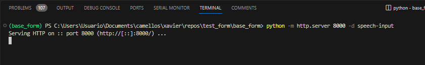
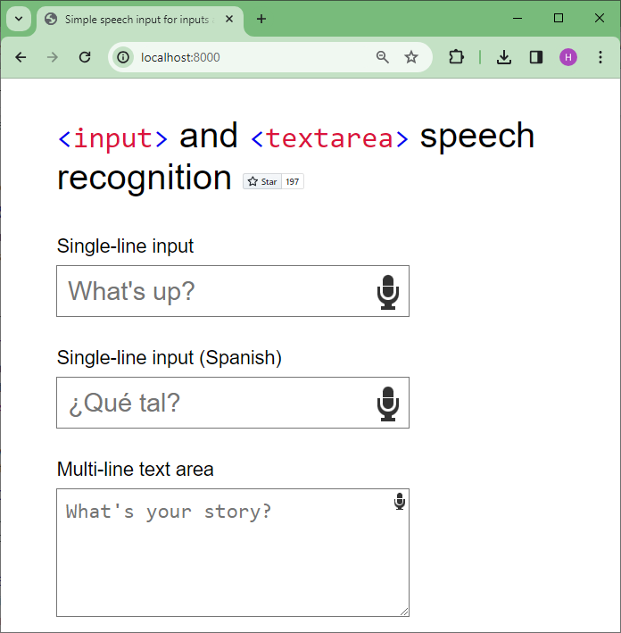
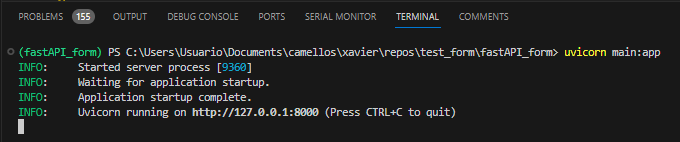
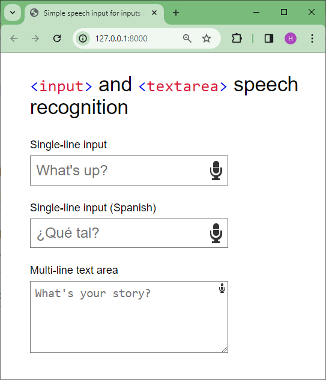
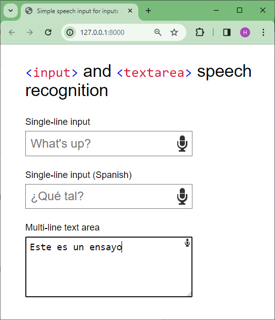

# Pruebas de formulario

## Actividades

- [x] Poner a funcionar localmente el codigo del repo: https://github.com/Daniel-Hug/speech-input.
- [x] Integrar el funcionamiendo de este codigo con FastAPI.
- [ ] Adaptar un formulario sencillo que haga uso de este codigo con FastAPI.
- [ ] Mirar como hacer una template de donde se obtengan datos.

### Actividad 1 - Funcionamiento servidor local

El repositorio de donde se tomo el código: https://github.com/Daniel-Hug/speech-input, lo unico que se hizo fue crear un entorno virtual (**base_form**) y ponderlo a correr desde un servidor local sencillo (Para mas información ver: [How to Launch an HTTP Server in One Line of Python Code](https://realpython.com/python-http-server/)). A continuación se detallan los pasos:

1. Entorno virtual 
   
   ```
   python -m venv base_form
   cd base_form
   .\Scripts\activate
   python --version 
   ```

2. En nuestro caso, la version de python es: ```Python 3.11.5````. Ahora vamos a ejecutar servidor local de python tomando como directorio de prueba base la carpeta [speech-input](base_form/speech-input/). En este directorio se coloca todo el contenido del [repositorio original](https://github.com/Daniel-Hug/speech-input) y se sirve.
   
   ```
   python -m http.server 8000 -d speech-input
   ```

   Si todo marcha bien debe salir algo como la siguiente imagen:

   
   
3. Dentro de la carpeta [speech-input](base_form/speech-input/) se encuentra el archivo asociado al formulario [index.html](base_form/speech-input/index.html). Una vez arrancado el servidor se hace la prueba en el navegador usando la siguiente URL: ````localhost:8000``. Si todo esta bien sale lo siguiente:
   
   

   Se mira que funcione.

4. Si ya no hay nada por hacer, salir del entorno virtual:

   ```
   deactivate
   ```

#### Conclusion

La prueba salió segun lo esperado.

### Actividad 2 - Funcionamiento del codigo anterior usando FastAPI

Se va a repetir el procedimiendo general pero en este caso el objetivo es que el mismo programa pueda ser llamado desde FastAPI. Para esto se va a crear un nuevo entorno virtual.

```
# Crear el entorno
python -m venv fastAPI_form
# Acceder y activar el entorno
cd fastAPI_form
.\Scripts\activate
python --version 
# Instalar librerias
pip install fastapi
pip install "uvicorn[standard]"
pip install jinja2
```

Una vez hecho lo anterior, se copio todo el contenido del [repositorio original](https://github.com/Daniel-Hug/speech-input) en el directorio [webpages](fastAPI_form/webpages/) y se hicieron unos cambios menores en el archivo del formulario [index.html](fastAPI_form/webpages/index.html) con el fin de que las rutas de los estilos y el codigo javascript se pueda cargar con FastAPI. 

Finalmente en el directorio raiz del proyecto ([fastAPI_form](fastAPI_form/)), se agrego el archivo python que hace el render de la pagina del formulario. Para ejecutar la aplicación se ejecuta el comando:

```
uvicorn main:app 
```

La salida es mas o menos la siguiente:




Luego, lo que se hace es cargar la pagina desde el browser usando la URL: ``` http://127.0.0.1:8000``` 



Si realizamos la grabación en el area de texto diciendo las palabras: "Esto es un ensayo", la información se transcribe tal y como se muestra a continuación:



Finalmente, se sale del servidor con dadon en consola:

```
CTRL + C
```

Y para salir del entorno, se ejecuta el comando:


```
deactivate
```

#### Conclusion

La prueba salió segun lo esperado.

## Referencias

1. https://www.phpied.com/x-webkit-speech-input-and-textareas/
2. https://github.com/szabgab/slides/tree/main/python/examples/fastapi
4. https://larachat.co/articles/add-dictation-speech-to-text-to-input-textarea-speechrecognition-api-we
5. https://medium.com/web-developer/add-dictation-speech-to-text-to-input-textarea-speechrecognition-api-web-browser-9d0dd7fec1c7
6. https://github.com/radzenhq/radzen-blazor/issues/699
7. https://stackoverflow.com/questions/75419202/textarea-text-voice-to-text-using-javascript
8. https://daniel-hug.github.io/speech-input/
9. https://medium.com/web-developer/add-dictation-speech-to-text-to-input-textarea-speechrecognition-api-web-browser-9d0dd7fec1c7
10. https://github.com/no22/jquery-webkit-speech-to-text
11. https://github.com/Daniel-Hug/speech-input
12. https://gist.github.com/rochacbruno/f444466f06ecf88085ab363105d4c505
